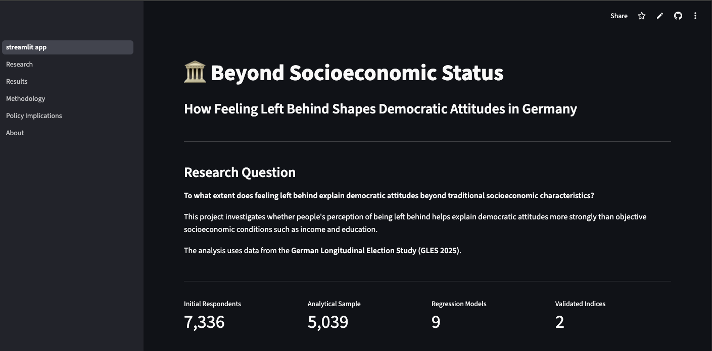

# 🏛️ Beyond Socioeconomic Status



## How Feeling Left Behind Shapes Democratic Attitudes in Germany

An interactive data analytics project exploring whether **feeling left behind** explains democratic attitudes beyond traditional socioeconomic characteristics such as household income and education.

🔗 **Live Dashboard:** https://democratic-connection-germany.streamlit.app/

---

# Research Question

**To what extent does feeling left behind explain democratic attitudes beyond traditional socioeconomic characteristics?**

This project investigates whether a newly constructed **Left Behind Index** provides additional explanatory power for democratic attitudes after controlling for:

- Household income
- Education
- Age
- East/West Germany
- Migration background
- Political interest
- Subjective Social Class

---

# Main Findings

After controlling for traditional socioeconomic variables:

- ✅ The **Left Behind Index** remained the strongest predictor of **Institutional Trust**.

- ✅ The index also emerged as the strongest predictor of **Democratic Satisfaction**.

- ✅ The relationship with **Political Representation** was statistically significant but substantially weaker.

These findings suggest that subjective perceptions of being left behind capture an important dimension of democratic attitudes that is not fully explained by objective socioeconomic conditions.

---

# Methodology

The project combines social science theory with reproducible quantitative analysis.

### Analytical Workflow

- Data cleaning and preprocessing
- Construction of composite indices
- Reliability analysis (Cronbach's Alpha)
- Exploratory Factor Analysis (EFA)
- Spearman correlation analysis
- Multiple Linear Regression (OLS)
- Variance Inflation Factor (VIF)
- HC3 robust standard errors

---

# Dashboard

The interactive Streamlit application includes:

- 🏠 Home
- 📚 Research
- 📊 Results
- 🔬 Methodology
- 💡 Policy Implications
- 👤 About

---

# Dataset

**German Longitudinal Election Study (GLES) 2025**

- Initial sample: **7,336 respondents**
- Analytical sample: **5,039 respondents**

**Source**

German Longitudinal Election Study (GLES), Post-Election Cross-Section 2025 (ZA10100)

---

# Tools & Technologies

- Python
- Pandas
- NumPy
- Statsmodels
- Plotly
- Streamlit
- Git
- GitHub

---

# Repository Structure

```text
streamlit_app.py

pages/
├── 1_Research.py
├── 2_Results.py
├── 3_Methodology.py
├── 4_Policy_Implications.py
└── 5_About.py

images/
└── home.png

requirements.txt
README.md
```

---

# Limitations

The analyses are based on cross-sectional observational data.

Results describe **statistical associations rather than causal relationships**.

---

# Author

**Ricardo Martins Batista**

Berlin, Germany

Sociologist • Programme Manager • Data Analyst

### Areas of Interest

- Data Analytics
- Public Policy
- Democratic Participation
- Sustainability
- Social Impact

---

## Live Application

https://democratic-connection-germany.streamlit.app/